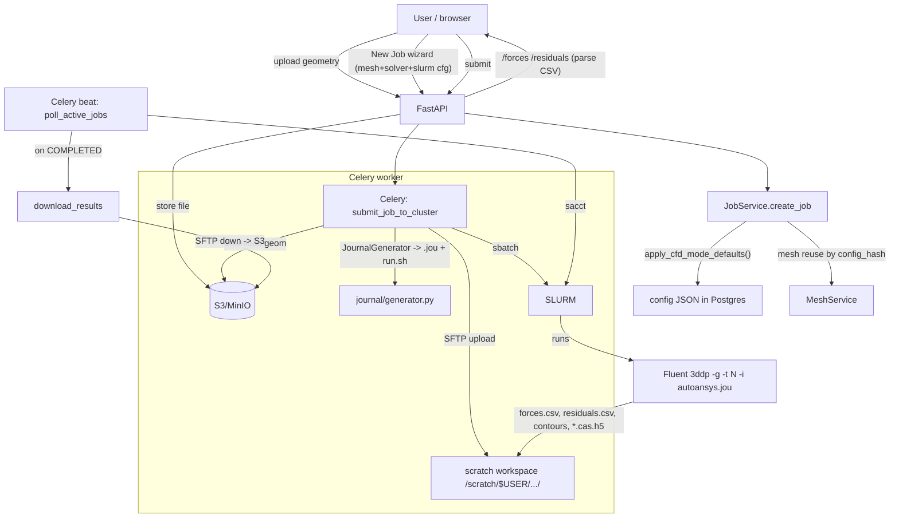
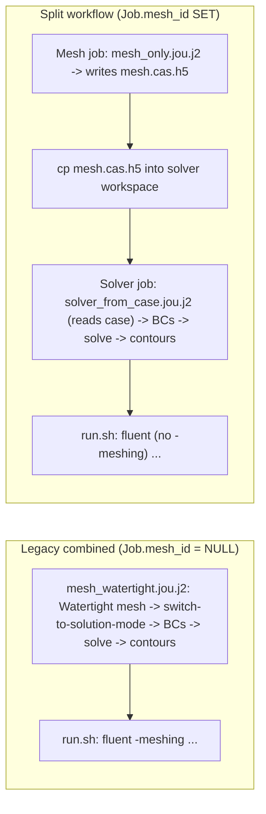

# AUDIT.md — AutoAnsys CFD Automation Pipeline

**Status:** Phase 1 (Discover & Audit) — *read-only, no functional changes made.*
**Branch:** `audit/cfd-pipeline-review`
**Date:** 2026-06-23
**Auditor scope:** correctness, robustness, reproducibility, efficiency of the geometry→results CFD pipeline, with the component vs full-car run-profile mandate as the lens.

> This document **describes and diagnoses**. It does not change behaviour. Every defect cites a
> file/line and a concrete failure mode. Fixes are deferred to `PLAN.md` (Phase 2) and require
> maintainer approval first. Items I could not verify without the real cluster are marked
> **[needs-cluster]**; physics judgements are marked **[physics]**.

---

## A. Inventory & Architecture

### A.1 What this actually is

This is **not** a standalone journal/script — it is a **full-stack web application** that wraps the
Fluent-on-SLURM workflow:

| Layer | Tech | Location |
|---|---|---|
| Frontend | React + TypeScript + Vite + React Query + Zustand | `frontend/` |
| API | FastAPI (async SQLAlchemy 2.0) | `backend/app/api/`, `backend/app/main.py` |
| Auth | JWT (python-jose, bcrypt) | `backend/app/auth/` |
| Business logic | Service layer | `backend/app/services/` |
| Async work | Celery + Redis (worker + beat) | `backend/app/tasks/` |
| Persistence | PostgreSQL + Alembic (5 migrations) | `backend/app/models/`, `backend/alembic/` |
| Object store | S3 / MinIO (geometries, results) | via `boto3` |
| Cluster I/O | Paramiko SSH/SFTP + SLURM CLI | `backend/app/cluster/` |
| **CFD codegen** | **Jinja2 → Fluent journals + SLURM script** | **`backend/app/journal/`** |

Counts: ~59 backend `.py` files (~5.4k LOC in `app/`), ~50 frontend `.tsx/.ts` files. Infra:
`docker-compose.yml` (7 services), Dockerfiles, `entrypoint.sh`.

**Locked-in environment (confirmed from the repo, no longer "to fill in"):**
- **Cluster:** Virginia Tech **ARC TinkerCliffs** (`.env`, `docs/SUBMITTING_JOBS.md`). Login nodes
  `tinkercliffs1/2`; compute nodes `tcNNN`; partitions `normal_q`, `preemptable_q`, `a100_*_q`.
  Standard node = 128 cores / ~256 GB (hence the `mem=243G`, `cores_per_node=128` defaults).
- **Automation mechanism:** **Fluent journal/TUI** (`.jou`) generated from **Jinja2** templates,
  with embedded `(%py-exec ...)` calls into the **PyFluent meshing workflow API**. Not Workbench,
  not standalone PyFluent driving.
- **Fluent version:** **ANSYS/2025R1** (`config.py:37`, `.env:29`). Several template comments record
  2025R1-specific quirks the team hit (e.g. `SaveFacetedFile` removed; `OneZonePer='label'` rejected).
- **Geometry ingress:** browser **upload** → S3 (`POST /api/geometries/upload`); recommended format
  per SOP is **Parasolid** (`docs/SUBMITTING_JOBS.md`).
- **Scheduler:** **SLURM** via SSH (`sbatch`/`sacct`/`squeue`/`scancel`), polled by Celery beat.

### A.2 Pipeline data flow (current, as-built)



**Two journal paths** (selected per job in `tasks/job_tasks.py:128-218`):



### A.3 Stage → module map

| Stage | Where | Notes |
|---|---|---|
| Ingestion | `api/geometries.py`, `api/files.py` → S3 | upload only; no validation/repair of the CAD |
| Geometry import / repair | Fluent Watertight `Import Geometry` task in `mesh_*.jou.j2` | assumes enclosure + face labels **pre-built in Discovery**; no wrap/heal |
| Domain / enclosure | **none in-pipeline** | `EnclosureConfig`/`WindTunnelConfig` are *documentation only* (`schemas/job.py:54-82`) |
| Meshing | `mesh_watertight.jou.j2`, `mesh_only.jou.j2` | Watertight workflow only |
| Solver setup | `_bc_block.jou.j2`, `solver_from_case.jou.j2` | flat TUI from typed BC lists |
| Solve / submit | `slurm_job.sh.j2`, `cluster/slurm.py`, `tasks/job_tasks.py` | sbatch over SSH |
| Post | contour block in templates; `tasks/job_tasks.py download_results` | PNG + CSV → S3 |
| Result return | `api/jobs.py` `/forces` `/residuals`; `services/job_service.py` parsers | CSV → JSON |

### A.4 Provisioning & dependencies

- **App:** Docker Compose (`docker-compose.yml`), `backend/requirements.txt` (pinned),
  `frontend/package.json`. `entrypoint.sh` runs `alembic upgrade head` then uvicorn.
- **Cluster:** **Lmod** (`module reset; module load ANSYS/2025R1`). No conda/venv on the cluster
  side — Fluent is the only dependency, via the module.
- **Mock mode:** `CLUSTER_MOCK_MODE` swaps in `cluster/mock.py` so the whole UI works with no cluster.

### A.5 How component vs full-car is handled **today**

Partially, and **only at the boundary-condition level**:
- `cfd_mode: "individual_part" | "full_car"` is a free-string field on `JobCreate`/`SweepCreate`/mesh
  config (`schemas/job.py:382`).
- `apply_cfd_mode_defaults(mode, solver_config)` (`schemas/job.py:271-358`) seeds BC presets, iteration
  count, and reference area **iff all BC lists are empty**.

It does **not** drive: mesh workflow (watertight vs fault-tolerant/wrap), domain sizing, symmetry &
the half-car force factor, y+/wall treatment, or **SLURM resource sizing**. So "run profile" is today
a *BC preset selector*, not the first-class profile the mandate requires. There is **one** code path
(good — not a forked script), but the switch is under-powered. See C9/C10/S4.

---

## B. Stage-by-stage assessment

Legend: ✅ works · ⚠️ works but fragile/wrong-in-cases · ❌ broken.

| Stage | State | Summary (evidence in section C/D/E) |
|---|---|---|
| Ingestion (upload→S3) | ✅ | Clean. No CAD validation/repair (C10). |
| Geometry import | ⚠️ | Only works if the **enclosure + face labels were built in Discovery** and exported in the file. A bare/dirty part fails (C10, C11). |
| Domain/enclosure | ❌ (absent) | Pipeline never builds or checks a domain; config is decorative (C10). |
| Meshing | ⚠️ | Watertight only; prism/first-layer config is **ignored** (C6); no fault-tolerant/wrap (C11). |
| Solver setup / BCs | ⚠️ | Flat TUI is reasonable, but hardcoded zone names (C8), missing density (C4), full_car has no outlet (C8). |
| Force reporting | ❌ | Reports **raw force on all walls**, mislabeled as coefficients, no symmetry factor (C1–C3). |
| Solve/SLURM submit | ⚠️ | Single-node OK; **multi-node launch broken** (S1); per-profile sizing absent (S4). |
| Post (contours) | ⚠️ | OK in split path; **undefined zone vars in legacy path** (C7). |
| Result parse/return | ❌ | Parsers match the **mock CSV**, not real Fluent report files (S7). |
| OOD "session" mode | ❌ | Imports a module that doesn't exist (E1). |

---

## C. Domain-correctness review (CFD)

> These are the highest-priority findings — they affect whether the numbers are *trustworthy*.

### C1 — Half-car symmetry force factor is never applied  **[physics] — CRITICAL**
There is no ×2 (or area halving) anywhere for symmetric/half-domain runs.
- Symmetry planes are applied (`_bc_block.jou.j2:69-72`); the `individual_part` preset includes a
  `symmetry` plane (`schemas/job.py:353`).
- Forces are read straight through with no factor: `services/job_service.py:387-404`
  (`_parse_forces_csv`).
- **Effect:** a symmetric component run reports **half** the true downforce/drag. This is the exact
  "classic silent bug" called out in the mandate, and it is present.

### C2 — "Cd/Cl/Cm" are raw **forces (N)**, not coefficients  **[physics] — CRITICAL**
- `solver_from_case.jou.j2:38-40` (and `mesh_watertight.jou.j2:140-142`, `solver_run.jou.j2:8-10`):
  `/solve/report-definitions/add cd force force-vector 1 0 0 ...`. The **`force`** report type returns
  Newtons. The reference values set at `_bc_block.jou.j2:13-15` (`area/length/velocity`) are **ignored
  by `force` reports** — they only feed `drag`/`lift`/`force-coefficient`/`moment-coefficient`.
- Yet everything downstream treats them as coefficients: `ForceReport{cd,cl,cm}`
  (`schemas/job.py:429-433`), the UI force chart, the compare view's "force coefficient" cards.
- Corroboration: `docs/UPGRADES.md` #9 lists "Reference area and **coefficient normalization**
  settings" as a *TODO* — the team already knows normalization isn't happening.
- **Effect:** real runs would emit forces (hundreds–thousands of N) into columns labeled Cd/Cl/Cm.
  Either switch to `lift`/`drag`/coefficient report types (and set density), or divide by ½ρV²A in
  post — but pick one and label honestly.

### C3 — Force integrated over **all** wall zones, not just the body  **[physics] — HIGH**
`thread-names *` (`solver_from_case.jou.j2:38-40`, etc.) selects **every** thread. The drag/lift then
includes pressure+shear on the **moving ground**, **slip tunnel walls**, and any far-field walls — not
just the car/part. Force must be scoped to the body wall zone(s). As-is the integral is unphysical.

### C4 — Reference **density** (and fluid properties) never set  **[physics] — HIGH**
`_bc_block.jou.j2:12-15` sets area/length/velocity but **not** `/report/reference-values/density`, and
air ρ/μ are never set explicitly anywhere. Once C2 is fixed to coefficient reports, Cd/Cl would use
whatever density Fluent defaults to. Make ρ (and the reference density) explicit and config-driven.

### C5 — Convergence judged on residuals only, not force plateau  **[physics] — MEDIUM**
Templates set `/solve/monitors/residual/convergence-criteria` + a fixed `/solve/iterate N`. There is
**no** `/solve/convergence-conditions` tied to the cd/cl report. The config even has the knobs —
`ConvergenceConfig.force_monitor_window`, `force_monitor_tolerance` (`schemas/job.py:244-245`) — but
**they are never emitted to any template**. The mandate explicitly wants force-coefficient-plateau
convergence.

### C6 — Prism/inflation & y+ are uncontrolled and partly **dead config**  **[physics] — HIGH**
- `Add Boundary Layers` uses `last-ratio` with **defaults** (`mesh_only.jou.j2:60-62`).
- `VolumeMeshConfig.first_layer_height=5e-5`, `num_layers=15`, `bl_growth_rate=1.2`
  (`schemas/job.py:47-51`) are defined but **never passed** into the boundary-layer task → the user's
  first-layer height is silently ignored.
- `TurbulenceConfig.near_wall_treatment="auto"` (`schemas/job.py:125`) is **never emitted** to Fluent.
- **Effect:** y+ is whatever the Watertight defaults produce; it is not tied to the k-ω SST wall
  treatment, and there's no consistency guarantee (wall-resolved y+≈1 vs wall-function 30–300). The
  5e-5 m first layer hints at wall-resolved intent, but it's not actually applied.

### C7 — Legacy combined journal emits **empty contour surfaces**  **[bug] — MEDIUM**
`mesh_watertight.jou.j2:188,198,208` reference `{{ inlet_zone }} {{ outlet_zone }} {{ ground_zone }}`.
Those variables are only defined in `solver_from_case.jou.j2:82-84`; the combined template and its
render context (`generator.py:47-54`) **never set them** → Jinja renders them empty →
`/display/set/contours/surfaces  ()`. Boundary contours are broken for every legacy combined job.

### C8 — Hardcoded zone names / missing-zone fragility; full_car has no outlet  **[bug/physics] — MEDIUM**
- `/define/boundary-conditions/zone-type enclosure fluid` hardcodes the literal `enclosure`
  (`solver_from_case.jou.j2:20`, `mesh_watertight.jou.j2:118`). If the cell zone isn't named
  `enclosure`, the TUI errors.
- The default `original_zones=[inlet,outlet,ground,symmetry,walls]` (`schemas/job.py:103-111`) and the
  presets assume those exact Discovery labels; the scheme does **not** degrade gracefully when a zone
  is absent (e.g. a wing with no ground/symmetry).
- The **`full_car` preset omits a pressure outlet entirely** (`schemas/job.py:295-332` — inlet, ground,
  tires, slip walls, but no `pressure_outlets`). An external-aero domain with no outlet is suspicious;
  it may mirror the specialist's closed-tunnel setup, but it needs confirming (open question F).

### C9 — `full_car` preset is internally inconsistent about symmetry  **[physics] — HIGH**
`full_car` sets reference area **0.65 m²** (looks like a *half*-car frontal area) **but** includes **no
symmetry plane** and does **no** force doubling (`schemas/job.py:295-338`). Either it's a full
geometry (area should be the full ~1.3 m² and forces are already whole) or a half geometry (needs a
symmetry plane **and** ×2). As written it is neither coherent — ties directly to C1.

### C10 — The pipeline never builds or checks the domain  **[gap] — HIGH**
`EnclosureConfig`/`WindTunnelConfig` are explicitly **documentation-only**
(`schemas/job.py:64-69` docstring: *"captured here for auditability … not to drive Fluent"*). The
Watertight flow assumes the enclosure was built in Discovery and exported inside the geometry file.
Consequences for a "hand it a part and get results" tool:
- A bare component Parasolid (no enclosure) **cannot be meshed** by this flow.
- No bounding-box-relative enclosure sizing (upstream/downstream/side multiples).
- No **blockage-ratio** check.
This is a core mandate item ("enclosure sized from part bounding box; blockage ratio sane").

### C11 — Only Watertight meshing; no fault-tolerant / surface-wrap path  **[gap] — HIGH**
`generator.py` + templates implement **only** the Watertight Geometry workflow (good for clean
components). Dirty full-car STEP assemblies — the mandate's main concern — need **Fault-tolerant
Meshing + surface wrapping**. There is no such path, and the choice is not tied to the run profile.

### C12 — Wheels via rotating walls only (no MRF option)  **[physics] — LOW/INFO**
`rotating_walls` apply a tangential wall velocity (`_bc_block.jou.j2:36-41`). That's a common
simplification; MRF cell zones are sometimes preferred for detailed/treaded wheels. Acceptable, worth
exposing as a profile choice later.

---

## D. SLURM & HPC review

### D-summary
| # | Item | Verdict |
|---|---|---|
| S1 | Multi-node Fluent launch | ❌ broken (no hostfile/MPI/interconnect) |
| S2 | License env / HPC Pack | ⚠️ relies on module only; not handled |
| S3 | `--mem`+`--exclusive`, walltime format | ⚠️ redundant/inflexible |
| S4 | Per-profile resource sizing | ❌ absent (one flat schema) |
| S5 | Dependency chaining / array jobs | ⚠️ done in app, not in SLURM |
| S6 | `sync` cancel-state parsing | ⚠️ bug (doesn't strip "CANCELLED by") |
| S7 | Force/residual CSV parsing | ❌ matches mock, not real Fluent |
| — | SLURM env-var use, exit codes, scratch | ✅ good |

### S1 — Multi-node launch is broken  **[bug] — HIGH (blocks full-car scale-out)**
`slurm_job.sh.j2:65`:
```bash
fluent 3ddp ${FLUENT_MODE_FLAG} -g -t${NCORES} -i autoansys.jou
```
For `nodes>1` this is missing everything that makes Fluent span nodes: no `-cnf=<hostfile>` (built
from `scontrol show hostnames $SLURM_JOB_NODELIST`), no `-mpi=intel`, no interconnect flag
(`-pib`/InfiniBand). On a 2-node allocation it will either fail or cram all ranks onto one node.
Single-node works because TinkerCliffs nodes are 128 cores and the default is `nodes=1,
cores_per_node=128` (`schemas/job.py:365-366`) — but that means the full-car profile that *needs*
>128 cores cannot scale. The mandate calls this out explicitly.

**What is already correct (Chesterton's fence — keep it):** the SBATCH header deliberately uses
`--ntasks-per-node=N --cpus-per-task=1` with a comment explaining that ARC binds by task and the
`--cpus-per-task=N` form goes silently serial (`slurm_job.sh.j2:7-13`). `NCORES=${SLURM_NTASKS:-...}`
and `-t${NCORES}` are consistent. Exit-code propagation via `PIPESTATUS[0]` is correct
(`slurm_job.sh.j2:66-73`). These are right and must be preserved.

### S2 — License env / HPC Pack not handled  **[gap] — MEDIUM**
No `ANSYSLMD_LICENSE_FILE` / `ANSYSLI_SERVERS` set anywhere; the script relies entirely on
`module load ANSYS/2025R1` to wire licensing. HPC Pack licensing (which gates the core count at which
parallel runs are allowed) is not addressed. Needs a maintainer answer (open question F) and likely
explicit env in the script.

### S3 — `--mem` with `--exclusive`; integer-hour walltime  **[quality] — LOW**
`slurm_job.sh.j2:14-16`: `--exclusive` already reserves the whole node, so `--mem=243G` is redundant
and can over-constrain. `--time={{ "%02d" | format(walltime_hours) }}:00:00` supports only whole hours
(and `%02d` caps at 2 digits / truncates floats). Inflexible but not breaking.

### S4 — SLURM resources not differentiated by run profile  **[gap] — MEDIUM**
`SlurmConfig` is one flat model (`schemas/job.py:364-371`); defaults (128c/243G/24h) are not selected
by component vs full-car. The mesh task does sensibly hard-cap meshing to 16 cores / 1 node
(`mesh_tasks.py:157-163`, with a good comment about Watertight being single-threaded) — keep that —
but the solver/combined job has no per-profile sizing. A component should request far less than a
full car.

### S5 — No SLURM dependency chaining / array jobs  **[efficiency] — MEDIUM**
The mesh→solve split exists at the **app/Celery** level (mesh completes, poller triggers solver
submit), not as SLURM `--dependency=afterok:`. Sweeps create **N independent jobs**
(`api/jobs.py:137-212`) rather than a `--array`. Functional, but less robust/efficient than the
mandate's target and loses SLURM-native accounting/throttling.

### S6 — `sync` path mis-parses cancelled state  **[bug] — LOW**
`services/job_service.py:244-245` (`_sync_batch_job`) does `_SLURM_STATE_MAP.get(raw_state)` **without**
`.split()[0]`, unlike the poller which strips it (`tasks/job_tasks.py:289-291`). `sacct` emits
`CANCELLED by <uid>`, so a manual `scancel` reconciled via the Sync button maps to `None` ("unknown
state") instead of `cancelled`. Same defect in `mesh_service.py:224-227`.

### S7 — Result parsers are coupled to the **mock** CSV, not real Fluent  **[bug] — HIGH [needs-cluster]**
`_parse_forces_csv` (`services/job_service.py:387-404`) uses `csv.DictReader` expecting **comma**-
delimited columns named exactly `iteration,cd,cl,cm` — which is precisely what the **mock** generator
writes (`tasks/job_tasks.py:483-501`). Real Fluent `/solve/report-files` output is **whitespace/tab**-
delimited with a multi-line header and different column names/order (and a flow-time column in some
configs). So against real output, `DictReader` finds none of those keys and the `/forces` endpoint
returns `[]`. The residual parser (`:406-426`, expecting `continuity,x_velocity,...`) has the same
shape mismatch. **This means the app has likely only ever been exercised end-to-end in mock mode.**
The exact real format must be captured from a cluster run to fix precisely.

### What's good on the HPC side (preserve)
- Uses `SLURM_NTASKS`, `SLURM_JOB_ID`, `SLURM_NODELIST`, `SLURM_NTASKS_PER_NODE` in the script header
  and echoes them for debugging (`slurm_job.sh.j2:33-42`).
- Runs in **scratch** (`CLUSTER_WORKSPACE_BASE=/scratch/...`), not home.
- `module reset` before `module load`.
- Non-zero Fluent exit → script `exit $FLUENT_EXIT` → SLURM `FAILED` → state map → job `failed`.
- Transient SSH errors trigger Celery retry, not a hard fail (`tasks/job_tasks.py:232-246`).

---

## E. Software-engineering review

### E1 — OOD "session" mode references a non-existent module  **[bug] — MEDIUM (dead/broken feature)**
`services/job_service.py:268-271` imports `MockSessionSSHManager` (absent from `cluster/mock.py`) and
`from app.cluster.session import SessionSSHManager` (**`cluster/session.py` does not exist** — confirmed:
`cluster/` has only `mock.py, sftp.py, slurm.py, ssh_manager.py, __init__.py`). `docs/SUBMITTING_JOBS.md`
documents OOD session mode with `srun --overlap`, but **no submit path creates a `session:` job**, so
the only way in is the sync path — which would raise `ImportError`/`AttributeError`. Either implement
it or remove it + the docs.

### E2 — Dead/superseded journal templates  **[cleanup] — LOW**
`solver_setup.jou.j2` and `solver_run.jou.j2` are **not referenced** by `generator.py` (which only loads
`mesh_watertight`, `mesh_only`, `solver_from_case`, `slurm_job`). They use an inconsistent older
approach (`/file/read-mesh`, Scheme `for-each` zone-name guessing, default **2000** iters). *Chesterton's
fence:* these are the earlier split attempt, superseded by `_bc_block.jou.j2` + `solver_from_case`.
Safe to remove once confirmed, but document the removal.

### E3 — Windows→Linux line-ending risk for generated `run.sh`  **[bug] — MEDIUM**
`.gitattributes` forces `*.sh` to `eol=lf` but **not** `*.sh.j2` or `*.jou.j2`. On a Windows clone with
`core.autocrlf=true`, `slurm_job.sh.j2` can be checked out with CRLF; the rendered `run.sh` (written via
`sftp.upload_string`, `cluster/sftp.py:27-33`) then carries `\r`, so `#!/bin/bash\r` fails on Linux with
`bad interpreter`. This repo is being developed **on Windows** (working dir is `C:\…`), so the risk is
live. Fix: add `*.j2 text eol=lf` (and/or normalize in the generator).

### E4 — Almost no automated tests  **[gap] — HIGH for Phase 4]**
Only `backend/tests/test_auth.py` (25 lines) + a client fixture. **Nothing** covers journal generation,
SLURM-script generation, force/residual parsing, `apply_cfd_mode_defaults`, sanitization, or the mesh
config-hash. README even says "Run backend tests (when added)". This is exactly the Fluent-free surface
Phase 4 should cover, and it's wide open.

### E5 — No per-run reproducibility metadata  **[gap] — MEDIUM**
Config is stored in Postgres, but nothing writes a run-metadata record (Fluent version + git SHA +
profile + timestamp + resolved config) into the workspace or S3 alongside results. Reproducing or
auditing a past run from the artifacts alone isn't possible.

### E6 — `sanitize_path` allows `..` traversal  **[security] — LOW**
`utils/sanitize.py:37-42` keeps `.` and `/`, so `../../x` passes through intact; it's used to build
`{workspace}/{geom_filename}` (`tasks/job_tasks.py:149,205`). Authenticated-user, own-scratch, so low
severity, but it should reject `..` and leading `/`.

### E7 — Logging is unstructured, no run correlation  **[quality] — LOW**
Stdlib `logging` only; no per-run log file or request/job correlation id threaded API→Celery→cluster.
(The cluster side does `tee fluent.log` — good.) `UPGRADES.md` #14 already tracks this.

### E8 — Documentation rot  **[docs] — LOW**
- `docs/SUBMITTING_JOBS.md:57-74` shows a SLURM example using `--ntasks-per-node=1
  --cpus-per-task=128` and `-t${SLURM_CPUS_PER_TASK}` — the **exact pattern the live template warns is
  "WRONG (silently serial)"** (`slurm_job.sh.j2:8-13`). Directly contradicts the code.
- `README`/`GETTING_STARTED` say workspaces live at `~/autoansys/jobs/`; the code uses `/scratch/...`
  (`config.py:32`).
- `docs/SUBMITTING_JOBS.md` references `module load Ansys/2025R1` (capital-A variant) vs `ANSYS/2025R1`
  elsewhere — the exact module string must be pinned (open question F).

### What's good on the SE side (preserve)
- Clean separation: api / services / tasks / cluster / journal / models / schemas.
- The enqueue-before-commit race is understood and handled (commit before `.delay`, plus a draft-state
  retry) — `services/job_service.py:170-181`, `tasks/job_tasks.py:113-116`.
- Mock layer lets the whole stack run with no cluster.
- `.env` is **not** committed (only `.env.example`); no private keys in git (verified via
  `git ls-files`). README's secret-handling guidance is sound.
- Mesh reuse by config hash (`services/mesh_service.py:27-39`) is a genuinely nice efficiency feature.
- Unique per-job/per-mesh workspaces keyed by UUID → no clobbering.

> **Local-only note (not a git leak):** the working-tree `.env` contains real-ish identifiers
> (`CLUSTER_USER=sakshamkumar`, `CLUSTER_HOST=tinkercliffs1.arc.vt.edu`, `CLUSTER_ACCOUNT=fsae`) and
> `CLUSTER_MOCK_MODE=false`. It is gitignored, so nothing is exposed — just be aware the local default
> points at the real cluster.

---

## F. Open questions / assumptions to confirm with the maintainer

1. **Symmetry intent (blocks C1/C9):** For full-car, do you run a **half model with a symmetry plane**
   (then we must add the symmetry BC + ×2 the forces, ref area ≈ full frontal) or a **full geometry**
   (then ref area should be full and 0.65 looks wrong)? What is the team's true full-car frontal area?
2. **Coefficients vs forces (C2):** Do you want the pipeline to report **coefficients** (Cd/Cl/Cm via
   Fluent `lift`/`drag` report types, needs density + area) or **forces in N** (then we rename the
   columns honestly)? What air **density** and properties should be assumed (sea-level 1.225?)?
3. **Force scope (C3):** What is the exact **body wall zone name/pattern** to integrate forces over
   (vs `*`)? e.g. `wall-car*`, `body*`?
4. **full_car outlet (C8):** Is the missing pressure-outlet intentional (closed tunnel) or an omission?
5. **Enclosure ownership (C10/C11):** Is the enclosure **always** pre-built in Discovery and exported
   in the geometry, or should AutoAnsys build it from the part bounding box (and add a wrap/fault-
   tolerant path for dirty assemblies)? This decides repair-vs-rework scope for meshing.
6. **Cluster specifics:** exact **module string** (`ANSYS/2025R1` vs `Ansys/2025R1`); which **MPI**
   (`intel`/`openmpi`) and **interconnect flag** Fluent should use on TinkerCliffs InfiniBand; the
   `--account`/QOS to use (`.env` says `fsae`); and how **HPC Pack** licensing is reached from compute
   nodes (env vars? bundled in the module?).
7. **OOD session mode (E1):** keep and implement, or remove (and drop from docs)?
8. **Real output formats (S7):** can you provide a sample real `forces.csv`/`residuals` and a
   `fluent.log` from one successful ARC run so the parsers and cell-count regexes can be fixed against
   ground truth?
9. **y+ target (C6):** wall-resolved (y+≈1) or wall-function (30–300) for k-ω SST? This sets the
   prism first-layer strategy per profile.

---

## Headline findings (Phase 1 conclusion)

**Architecture is sound; the *physics reporting* and *multi-node scaling* are not.** This is a
well-structured app with a real mesh/solver split, mock mode, and mesh reuse. But the numbers it would
return from a real run are currently **not trustworthy**, and the full-car profile can't scale out:

**Must-fix before any result is trustworthy (correctness):**
- **C1** — half-car symmetry force factor never applied (silent ½-magnitude bug).
- **C2** — "Cd/Cl/Cm" are raw forces, not coefficients; reference values don't apply to `force` reports.
- **C3** — forces integrated over *all* walls (ground/tunnel), not the body.
- **C9** — `full_car` preset is internally inconsistent (half-car area, no symmetry, no doubling).
- **S7** — result parsers match the mock CSV, not real Fluent output → `/forces` likely returns `[]`
  for real jobs (strong sign the real path was never validated end-to-end).

**Must-fix for the run-profile mandate (capability):**
- **C10/C11** — no in-pipeline enclosure sizing and no fault-tolerant/wrap path; "run profile" today
  is BC-only and doesn't drive mesh strategy, domain, symmetry, or SLURM sizing (**S4**).
- **S1** — multi-node Fluent launch missing hostfile/MPI/interconnect → full-car can't exceed one node.

**Important but lower-risk:** C4 (density), C5 (force-plateau convergence), C6 (dead prism/y+ config),
C7 (legacy contour vars), C8 (hardcoded zones), S2 (license env), S6 (sync cancel parse), E1 (broken
OOD mode), E3 (CRLF risk), E4 (no tests), E5 (no repro metadata), E8 (doc rot).

**Preserve (works, and there's a reason):** the `--ntasks-per-node=N/--cpus-per-task=1` SBATCH
binding, exit-code propagation, scratch usage, enqueue-before-commit handling, mock layer, mesh-reuse
hashing, and the meshing core-cap.

My initial lean is **hybrid: repair the orchestration/SLURM layer (it's mostly right), rework the
CFD-correctness layer (force reporting, symmetry, reference values) and elevate `cfd_mode` into a
real run-profile that drives mesh/domain/symmetry/SLURM**. I'll justify and detail this in `PLAN.md`.

**→ Stopping here for your review, per the Phase-1 gate.** Once you've reacted to the headline
findings and the open questions in §F (especially #1, #2, #5, #6), I'll write `PLAN.md` with a
repair-vs-rework recommendation and a milestone plan, and wait for approval before touching code.
