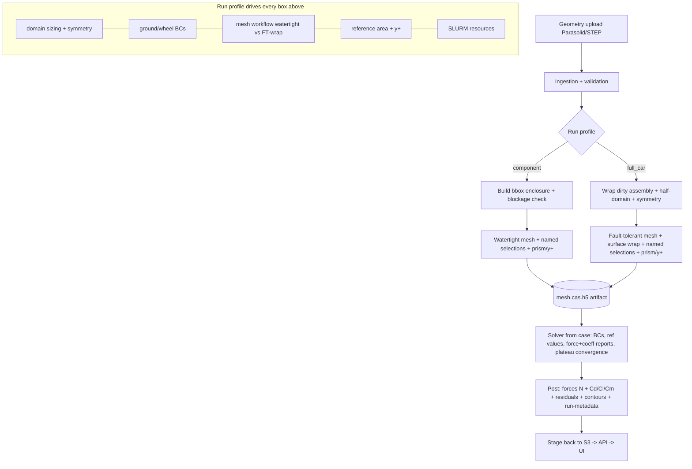

# PLAN.md — AutoAnsys Repair/Rework Plan

**Status:** Phase 2 (Decision & Plan) — *approval gate. No code changes until this is approved.*
**Branch:** `audit/cfd-pipeline-review`
**Predecessor:** [AUDIT.md](AUDIT.md)
**Date:** 2026-06-23

## Maintainer decisions locked in (from Phase-1 review)

| # | Question | Decision | Plan impact |
|---|---|---|---|
| 1 | Full-car symmetry | **Half-car + symmetry plane** | Pipeline must add the symmetry BC **and** apply a ×2 force factor; reference area = **full** frontal area. |
| 2 | Primary aero output | **Both** — forces (N) **and** coefficients (Cd/Cl/Cm) | Emit force *and* coefficient report defs; set reference density/area/velocity; honest column names. |
| 3 | Who builds the enclosure | **The pipeline** | Real rework of the meshing layer: bbox-sized enclosure + blockage check (component) and **fault-tolerant + surface-wrap** path (dirty full-car). |
| 4 | Sample real ARC artifacts | **No real run exists yet** | Confirms the end-to-end path was only ever exercised in **mock mode**. Build to the documented Fluent 2025R1 formats; validate Fluent-free; everything cluster-touching is a human-in-the-loop item. |

---

## 1. Recommendation: **Hybrid (repair the plumbing, rework the physics + meshing)**

The codebase splits cleanly into two halves with very different verdicts:

- **The orchestration / web / SLURM plumbing is fundamentally right** — service/task/cluster separation,
  mock layer, mesh-reuse-by-hash, enqueue-before-commit handling, scratch usage, exit-code
  propagation, the `--ntasks-per-node=N/--cpus-per-task=1` binding. **→ Repair in place.** Rewriting it
  would throw away correct, hard-won behaviour (the template comments document real 2025R1/ARC
  battles) for no benefit.

- **The CFD-correctness layer and the meshing layer are not trustworthy / not capable** — force
  reporting (C1–C4), convergence (C5), dead prism/y+ config (C6), and the absence of enclosure
  building + a dirty-geometry path (C10/C11). Given decision #3 these need genuine **rework**, not
  patching.

So: **keep the app skeleton and SLURM submission flow; rework journal generation, force/result
reporting, the run-profile engine, and the meshing strategy.** This matches the evidence (risk
concentrated in the journal/reporting code, not the orchestration) and the mandate's "pragmatism over
novelty" (we are *not* migrating to a PyFluent-driver rewrite — the journal+`%py-exec` approach is the
lower-risk path and already encodes working 2025R1 knowledge).

### Why not full rework
No real run has ever validated the end-to-end path (decision #4), so the *only* trustworthy reference
behaviour we have is the working specialist TUI flow encoded in `_bc_block.jou.j2` and the documented
2025R1 quirks. Discarding that and starting from PyFluent would throw away our only ground truth and
multiply unverifiable risk.

### Why not pure repair
Decision #3 (pipeline builds the enclosure + handles dirty assemblies) cannot be reached by patching —
the current Watertight-only flow assumes a pre-built enclosure. That stage is a rework.

---

## 2. Target architecture

### 2.1 Stage diagram (target)



### 2.2 Module boundaries (target — most files already exist; ✦ = new)

| Concern | Module | Change |
|---|---|---|
| Run-profile config (source of truth) | ✦ `backend/app/config/profiles.yaml` + `backend/app/config/profiles.py` | shared defaults + per-profile overrides; Pydantic-validated; one place |
| Config schema | `backend/app/schemas/job.py` | `apply_cfd_mode_defaults` becomes a thin shim over the profile engine |
| Journal generation | `backend/app/journal/generator.py` + templates | add enclosure/wrap, force+coeff reports, density, plateau convergence, prism/y+ |
| Named selections | ✦ `backend/app/journal/named_selections.py` | deterministic zone scheme, graceful degradation |
| Force/result parsing | `backend/app/services/job_service.py` (+ ✦ `backend/app/post/forces.py`) | real Fluent format; force→coeff; ×2 symmetry factor |
| SLURM script + launch | `backend/app/journal/templates/slurm_job.sh.j2` | hostfile, MPI, interconnect, per-profile sizing |
| Cluster I/O | `backend/app/cluster/*` | repair only (sync cancel parse); decide session.py fate |
| Reproducibility | ✦ run-metadata writer (in `tasks/`) | Fluent version + git SHA + profile + resolved config |
| Tests + dry-run | ✦ `backend/tests/*`, ✦ `--validate` CLI | Fluent-free golden tests + artifact dry-run |

### 2.3 Single config schema — run-profile design (sketch, for approval)

One YAML is the source of truth; the wizard/API override per job. Shared keys live under `defaults`;
each profile overrides only what differs.

```yaml
# backend/app/config/profiles.yaml  (illustrative — exact values TBD with maintainer)
defaults:
  turbulence: { model: k-omega-sst, curvature_correction: true, y_plus_strategy: wall-resolved }
  fluid:      { density: 1.225, viscosity: 1.7894e-5 }      # explicit, was missing (C4)
  freestream: { velocity_mps: 15.65 }
  convergence:
    residual_target: 1.0e-4
    force_plateau: { window: 100, tol: 1.0e-3 }             # NOW emitted (fixes C5)
  reporting:
    body_wall_pattern: "wall-body*"   # force scope, NOT '*' (fixes C3) — exact pattern = open Q F3
    emit_forces_newtons: true
    emit_coefficients: true                                  # both (decision #2)

profiles:
  component:
    domain:   { build_enclosure: true, up: 3, down: 8, side: 5, top: 5, blockage_max: 0.05 }
    symmetry: { plane: optional, force_factor: 1.0 }
    ground:   { moving: false }
    wheels:   { enabled: false }
    mesh:     { workflow: watertight }
    reference: { area_m2: <part frontal/planform>, length_m: <chord> }
    slurm:    { nodes: 1, cores: 64, mem_gb: 120, walltime_h: 6 }
    convergence: { max_iterations: 500 }

  full_car:
    domain:   { build_enclosure: true, wrap_dirty: true, half_domain: true, up: 3, down: 8, side: 5, top: 5, blockage_max: 0.05 }
    symmetry: { plane: required, force_factor: 2.0 }        # half-car + ×2 (decision #1)
    ground:   { moving: true, velocity_mps: 15.65, dir: [-1,0,0] }
    wheels:   { enabled: true, omega_rad_s: 77.0, axis: [0,1,0] }
    mesh:     { workflow: fault-tolerant, surface_wrap: true }
    reference: { area_m2: <FULL frontal area>, length_m: <wheelbase or ref> }  # open Q F1
    slurm:    { nodes: 2, cores_per_node: 128, mem_gb: 243, walltime_h: 24 }
    convergence: { max_iterations: 1500 }
```

Key invariant the engine enforces (correctness guards): *if `symmetry.plane == required` then a
symmetry BC must exist **and** `force_factor == 2.0` is applied in post; if `wheels.enabled` then
rotating-wheel BCs must be present (and absent for a bare component).*

---

## 3. Milestone plan (ordered, each independently testable)

> Correctness + test scaffolding land **before** the big meshing rework, so the trustworthy-numbers
> fixes are usable even if M5 takes longer.

### M0 — Test harness + dry-run/`--validate` (Fluent-free) **[foundation]**
- pytest fixtures; golden-file infra for generated `.jou` and `run.sh`.
- `--validate` mode: render every artifact for **both** profiles to a temp dir, no Fluent/SLURM.
- **Test:** generation tests exist and pass for current templates (locks behaviour before we change it).
- **Cluster needed:** no.

### M1 — Single config schema + run-profile engine
- Add `profiles.yaml` + loader; refactor `apply_cfd_mode_defaults` to read it; expose defaults to the
  frontend via an endpoint (kill the constants drift between back/front).
- Backward-compat: existing DB job configs still parse; legacy combined path untouched.
- **Test:** profile-resolution unit tests; both profiles produce expected resolved configs; old configs load.
- **Cluster needed:** no.

### M2 — Solver/reporting correctness (repair) — *makes numbers trustworthy*
- Set reference **density** + explicit air properties (C4).
- Scope force reports to the **body wall pattern**, not `*` (C3).
- Emit **both** force (N) and **coefficient** report defs (C2, decision #2).
- Ensure half-car **symmetry BC present** and apply **×2** in post (C1/C9, decision #1).
- Emit **force-plateau convergence** conditions, wiring the existing window/tol knobs (C5).
- Fix legacy contour undefined vars (C7) — or retire the legacy combined path (TBD in M6).
- Correctness **guards/asserts**: ref area/velocity/density set; wheel/ground present for full_car &
  absent for component; symmetry factor applied.
- **Test:** golden journals for both profiles assert the new lines; guard unit tests (raise on missing
  density, on full_car-without-symmetry, etc.).
- **Cluster needed:** physical magnitudes only (human-in-the-loop).

### M3 — Result parsing rework (to documented Fluent 2025R1 format)
- Rewrite force/residual parsers for real report-file format (whitespace-delimited, quoted multi-line
  header, optional flow-time col); keep mock compatibility; apply symmetry factor + coefficient
  derivation; tolerate missing files.
- **Test:** parser unit tests against **synthesized real-format fixtures** + the existing mock format.
- **Cluster needed:** yes, to confirm the real header exactly (flagged; we build to docs first).

### M4 — SLURM/HPC: multi-node launch + per-profile sizing
- Build hostfile from `scontrol show hostnames $SLURM_JOB_NODELIST`; add `-cnf`, `-mpi=intel`,
  interconnect flag (exact flag = open Q F6); **keep single-node path working unchanged**.
- Per-profile SLURM resource defaults from the profile engine.
- License env hook (`ANSYSLMD_LICENSE_FILE`/`ANSYSLI_SERVERS`) — parameterized, marked pending F6.
- Fix `sync` cancel-state parsing (S6).
- (If it clearly helps) SLURM `--dependency=afterok:` chaining + `--array` for sweeps.
- **Test:** golden sbatch for both profiles; hostfile-logic unit test; launch-line assertions per profile.
- **Cluster needed:** yes, to confirm multi-node actually spans nodes + license acquisition.

### M5 — Meshing rework: enclosure builder + fault-tolerant/wrap (decision #3) **[largest]**
- **Component:** size enclosure from part bounding box (up/down/side/top multiples), blockage check,
  Watertight.
- **Full-car:** fault-tolerant meshing + **surface wrap** path for dirty STEP; half-domain + symmetry.
- Wire prism **first-layer height / num-layers / y+** from config into Add Boundary Layers (fixes C6).
- Deterministic **named-selection** scheme that **degrades gracefully** (component has no wheels/ground).
- **Test:** golden mesh journals for both profiles; named-selection unit tests (absent-zone cases).
- **Cluster needed:** **yes — actual mesh success is a human-in-the-loop item.** Watertight stays the
  safe default; full-car wrap is gated behind the profile and clearly marked unvalidated.

### M6 — Robustness / reproducibility / cleanup
- Run-metadata record (Fluent version + git SHA + profile + timestamp + resolved config) → workspace + S3 (E5).
- `.gitattributes`: `*.j2 text eol=lf` (E3); `sanitize_path` rejects `..`/leading `/` (E6); structured
  logging + per-run log (E7).
- Decide **OOD session mode**: implement `cluster/session.py` + `MockSessionSSHManager`, or remove the
  dead refs + docs (E1) — recommend **remove** unless the team uses it (open Q F7).
- Remove dead templates `solver_setup.jou.j2`/`solver_run.jou.j2` after confirmation (E2).
- **Test:** metadata + sanitize unit tests.
- **Cluster needed:** no.

### M7 — Documentation & handoff (Phase 5)
- README (component + full-car end-to-end), config reference (every param + both profiles), `RUNBOOK.md`
  (sbatch/squeue/sacct/scancel + troubleshooting), architecture doc, change summary, and `VALIDATION.md`.
- Fix doc rot (E8): SLURM example, scratch path, module string.
- **Cluster needed:** no.

---

## 4. Risks & de-risking

| Risk | Likelihood | De-risk |
|---|---|---|
| Can't execute Fluent/SLURM here (decision #4) | certain | Golden-file Fluent-free tests + `--validate` dry-run for both profiles; every cluster-touching claim goes in `VALIDATION.md`, never reported as "passed". |
| Real report-file format differs from docs (S7) | high | Isolate parsing behind one tested function with synthetic real-format fixtures; flag for cluster confirmation; ask maintainer for one real sample later (Q F8). |
| Fault-tolerant/wrap journal is version-specific & unvalidated (M5) | high | Keep Watertight as the safe default for components; gate full-car wrap behind the profile; build incrementally; mark as the #1 cluster-validation item. |
| TinkerCliffs MPI/interconnect/license specifics unknown (S1/S2) | med | Parameterize (`-mpi`, interconnect, license env) from config; never hardcode; single-node path stays working as a fallback; open Q F6. |
| Config consolidation breaks stored jobs (M1) | med | Migrate **defaults**, not stored configs; keep legacy combined path + nullable `mesh_id`; old configs must still parse (test). |
| Scope creep into the UPGRADES.md backlog | med | Stay strictly within the audit's defect list + the 4 decisions; backlog items remain backlog. |

---

## 5. Human-in-the-loop cluster-only validation (will populate `VALIDATION.md`)

These **cannot** be verified from my environment and will be written as an explicit runbook for the
maintainer to run on ARC with a real Fluent license:

1. **Component case** end-to-end: upload → mesh → solve → results.
2. **Full-car case** end-to-end (the wrap + half-domain path).
3. **Mesh-independence** check (coarse/medium/fine) per profile.
4. **Physical sanity** of Cl/Cd/downforce/drag — magnitude **and sign**.
5. Confirm **monitored forces converged** (plateau), not just residuals.
6. Confirm **half-car forces were correctly doubled** (compare reported vs hand-calc).
7. Confirm **multi-node MPI actually spans nodes** (inspect `fluent.log` host list).
8. Confirm **license / HPC Pack** acquisition at the target core count.
9. Confirm **real report-file parsing** matches what Fluent actually writes (closes S7).

---

## 6. Open questions still needed before/within implementation

Carried from AUDIT.md §F, now narrowed by the 4 decisions:
- **F1:** full-car **full frontal reference area** (and reference length) values.
- **F3:** exact **body wall zone name/pattern** for force scoping (default guess `wall-body*`).
- **F6:** TinkerCliffs **module string** (`ANSYS/2025R1` vs `Ansys/2025R1`), **MPI** (`intel`?),
  **interconnect** flag, **account/QOS**, and **HPC Pack** license env.
- **F7:** keep or remove OOD session mode.
- **F9:** y+ target per profile (wall-resolved y+≈1 vs wall-function 30–300) — provisionally
  wall-resolved for k-ω SST.

These don't block starting M0–M2; they're needed by M4/M5 and the final reference-value guards.

---

## → Approval gate

**I will not start implementing until you approve this plan.** If M0–M7 and the run-profile schema in
§2.3 look right, say so (or adjust), and ideally answer F1/F3/F6 so M2/M4 land with real values instead
of placeholders. On approval I'll begin at **M0** and commit milestone by milestone on this branch.
