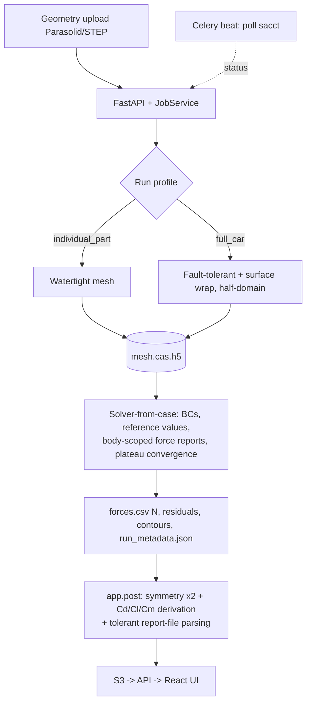

# Architecture

AutoAnsys is a full-stack app that turns an uploaded geometry into a trustworthy
Fluent-on-SLURM CFD result, driven by a single **run profile** switch.

## Stage pipeline

Two journal paths:
- **Split (recommended):** `mesh_only` / `mesh_fault_tolerant` → `mesh.cas.h5`,
  then `solver_from_case` consumes it. One mesh → many solves; sweeps reuse it.
- **Combined (legacy):** `mesh_watertight` does mesh + solve in one session
  (kept for backward compatibility; Watertight only).

## Module map

| Concern | Module |
|---|---|
| Run-profile source of truth | `app/profiles/profiles.yaml` + `app/profiles/__init__.py` (loader) |
| Config schema + per-mode defaults | `app/schemas/job.py` (`apply_cfd_mode_*_defaults`, `check_solver_correctness`) |
| Journal/SLURM generation | `app/journal/generator.py` + `templates/*.j2` |
| Dry-run / `--validate` | `app/journal/validate.py`, `app/journal/example_configs.py` |
| Force/coefficient math | `app/post/forces.py` (pure) |
| Report-file parsing | `app/post/report_files.py` (pure) |
| Reproducibility | `app/run_metadata.py` |
| Orchestration | `app/services/{job,mesh}_service.py`, `app/tasks/{job,mesh}_tasks.py` |
| Cluster I/O | `app/cluster/{ssh_manager,sftp,slurm,mock}.py` |

## Run-profile design

One YAML (`profiles.yaml`) holds shared `defaults` + per-profile overrides. A
profile selects, via `resolve_profile(mode)` and the `apply_cfd_mode_*_defaults`
functions, everything that differs between a component and a full car:

| Dimension | individual_part | full_car |
|---|---|---|
| Boundary conditions | inlet, outlet, moving ground, walls, symmetry | inlet, moving ground, rotating wheels, slip walls, symmetry |
| Symmetry / force factor | half-domain, ×2 | half-car, ×2 |
| Reference area | per-part (1.2 default) | full frontal (0.65 placeholder — F1) |
| Iterations | 300 | 750 |
| Mesh workflow | Watertight | Fault-tolerant (wrap) |
| SLURM | 1 node / 6 h | 2 nodes / 24 h |

The two profiles share **one** code path; the switch is config, not a fork. Defaults
are non-clobbering: presets only fill values the caller left at the schema default,
so a user customisation is never overwritten.

## Correctness invariants (enforced / guarded)

- Reference area, velocity, **density** are set (density was previously missing).
- Forces integrate over the **body wall pattern**, not all walls.
- A symmetry plane implies the **×2 force factor** (and vice-versa) — guarded.
- full_car has moving ground + rotating wheels; a bare component has neither.
- Forces (N) and derived coefficients (Cd/Cl/Cm) are both reported.

## Testing & verifiability

`app/post/*`, the profile loader, journal/SLURM generation (golden + invariants),
sanitization, and run-metadata are **unit-tested and pass without Fluent**. The
Fluent-Meshing journal internals (especially fault-tolerant) and the exact 2025R1
TUI/report formats are **cluster-validation items** — see [VALIDATION.md](VALIDATION.md).
